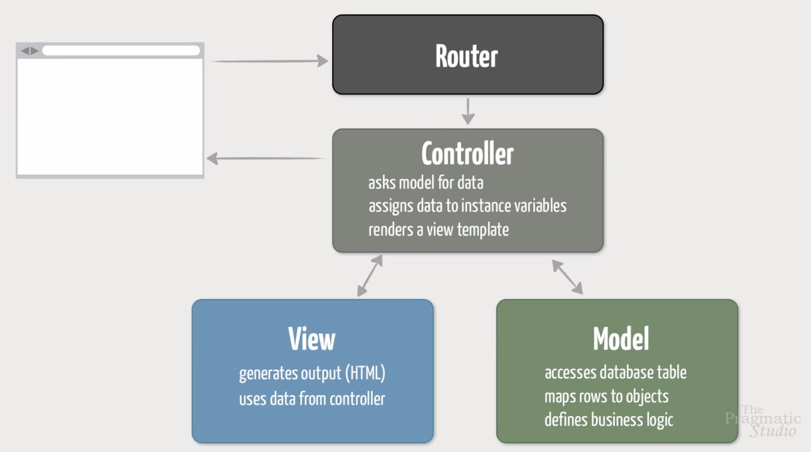
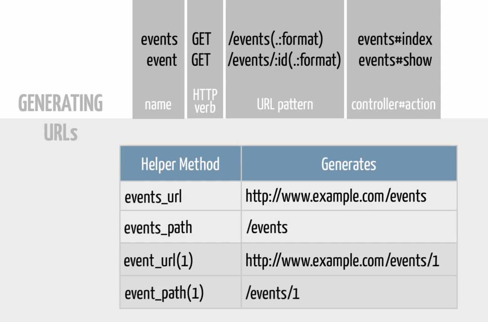

# Ruby on Rails: Level I

## Development Environment

```shell
rails c
```

## Create the App

```shell
rvm gemset use --create 2.5.1@events
rvm gemset list
gem install rails
rails new events
cd events
> .ruby-version
e> .ruby-gemset
```

### To lauch the server (localhost:3000)

```shell
rails s
```

### What's in each directory

* **app** is where you'll put the bulk of your application code. This is where you'll spend most of your time. Rails puts a lot of emphasis on keeping code organized, so the app directory has a number of subdirectories:

  * **assets** contains sub-directories where you'll store your application's images, JavaScript files, and stylesheets.

  * **models**, **views**, and **controllers** are appropriately-named directories where you'll organize your (wait for it) model, view, and controller code.

  * **helpers** is where you put Ruby modules that define utility methods for views.

  * **mailers** is where you put Ruby classes for generating and sending e-mails.

  * **jobs** is where you put Ruby classes for running background jobs. (Rails 5 only)

  * **channels** is where you put Ruby classes for handling real-time features using Action Cable. (Rails 5 only)

* **bin** isn't something you'll mess with. It contains the rails script file, for example.

* **config** is where you go to tweak the configuration settings of your application. Initially you won't have to touch most of the files in here because generated Rails apps are configured with "sensible defaults". Later in this course we'll make stops at the following places:

  * **database.yml** configures the database used by each environment.

  * **routes.rb** maps incoming requests (URLs) to application code.

  * **environments** is a directory that contains three files that define specific settings for each environment: development, test, and production.

  * **initializers** is a directory where you put Ruby code that needs to be run when the application starts.

* **db** contains everything related to the database, including migration files and, in the case of using the default SQLite3 database, the database file itself.

* **lib** is where you put any reusable "library" code that's not a model, view, or controller. It's more common these days to package this sort of code as a gem. But it has one important subdirectory:

  * **tasks** is where you would put any custom Rake tasks for your application, with each file having a .rake extension.

* **log** is where Rails automatically creates log files so you have a record of what happened when your app ran. Each environment gets its own log file.

* **public** is the document "root" directory of the app. It contains static files that are served directly by the web server. For example, 404.html lives here and gets served when a page can't be found.

* **test** is where you put test files if you use the default test library, organized further in the models, controllers, integration, helpers, and mailers directories. In this course we'll use the RSpec library, so you can ignore the test directory.

* **tmp** is where Rails stores any temporary files needed by the app. I can't recall the last time I even peeked in this directory.

* **vendor** is where, in the old days, we used to put third-party code. Nowadays we generally use gems declared in the Gemfile instead.

* The **Gemfile** file contains a list of third-party dependencies (Ruby gems) that your application needs.

## Views and Controllers

```ruby
# routes.rb
Rails.application.routes.draw do
  # verb "url" => "name_of_controller#name_of_action"
  get "events" => "events#index
end
```

```shell
rails g controller events
```

```ruby
# events_controller.rb
class EventsController < ApplicationController
  def index
    @time = Time.now
    @events = ['BugSmash', 'Hackathon', 'Kata Camp', 'Rails User Group']
  end
end
```

```erb
# index.html.erb
<h1><%= @events.size %> Events</h1>

Listing generated at <%= @time %>
<ul>
  <% @events.each do |event| %>
    <li><%= event %></li>
  <% end %>
</ul>
```

## ERb Tags

```erb
# runs the Ruby code and substitutes result into template
<%=           %>

# runs the Ruby code but does not substitute result into template
<%            %>
```

## Models

```shell
rails g model event name:string location:string price:decimal
```

```ruby
# 20181113142542_create_events.rb
class CreateEvents < ActiveRecord::Migration[5.2]
  def change
    create_table :events do |t|
      t.string :name
      t.string :location
      t.decimal :price

      t.timestamps
    end
  end
end
```

```ruby
# event.rb
class Event < ApplicationRecord
end
```

```shell
(to create the tables)
rails db:migrate

rails db:migrate:status
```

```shell
>> Event.conection
>> Event
=> Event(id: integer, name: string, location: string, price: decimal, created_at: datetime, updated_at: datetime)
>> e = Event.new
>> e.name
=> nil
>> e.name = "BugSmash"
>> e.location = "Denver, CO"
>> e.price = 0.00
>> e
=> #<Event id: nil, name: "BugSmash", location: "Denver, CO", price: 0.0, created_at: nil, updated_at: nil>
>> e.save
```

```shell
>> e = Event.new(name: "hackathon", location: "Austin, TX", price: 15.00)
>> e.save
```

```shell
e = Event.create(name: "Kata Camp", location: "Dallas, TX", price: 75.00)
```

```shell
>> Event.count
=> 3
>> Event.all
>> e = Event.first
>> e = Event.last
```

```shell
>> e = Event.find(3)
>> e.name
=> "Kata Camp"
>> e.name = "Kata Camp 2013"
=> "Kata Camp 2013"
>> e.price = 50.00
=> 50.0
>> e.save
```

```shell
>> e = Event.find_by(name: "Kata Camp 2013")
>> e.update(name: "Kata Camp", price: 75.00)
>> e.price.to_s
=> "75.0"
```

```shell
>> e = Event.find(1)
>> e.destroy
```

### List of supported database column types

* string
* text
* integer
* decimal
* float
* boolean
* binary
* date
* time
* datetime
* primary_key
* timestamp

### To see all the database-related tasks at your disposal

 ```shell
 rails -T db
 ```

## Connecting MVC



## Migrations

```shell
rails g migration AddFieldsToEvents starts_at:datetime description:text
rails db:migrate
```

## Helpers

```shell
>> helper.number_to_currency(1234567890.50)
=> "$1,234,567,890.50"
>> helper.pluralize(0, 'event')
=> "0 events"
>> helper.pluralize(1, 'event')
=> "1 event"
>> helper.pluralize(2, 'event')
=> "2 events"
```

```ruby
<tr>
  <th>Price:</th>
  <% if event.price == 0 %>
    <td>Free</td>
  <% else %>
    <td><%= number_to_currency(event.price) %></td>
  <% end %>
</tr>

# We can use a method:
<tr>
  <th>Price:</th>
  <td><%= format_price(event) %></td>
</tr>

# Then, in the events_helper.rb file:
module EventsHelper
  def format_price(event)
    if event.price.zero?
      '<strong>Free!</strong>'.html_safe
    else
      number_to_currency(event.price)
    end
  end
end

# Also we can change the condition
module EventsHelper
  def format_price(event)
    if event.free?
      content_tag(:strong, 'Free!')
    else
      number_to_currency(event.price)
    end
  end
end

# And then, in the event.rb file:
class Event < ApplicationRecord
  def free?
    proce.blank? || price.zero?
  end
end

```

## Routes: Show Page

```ruby
# routes.rb
Rails.application.routes.draw do
  get 'events' => 'events#index'
  get 'events/:id' => 'events#show'
end

#events_controler.rb
class EventsController < ApplicationController
  def index
    @events = Event.all
  end

  def show
    @event = Event.find(params[:id])
  end
end

#show.html.erb
<article>
  <header>
    <h2><%= @event.name %></h2>
  </header>
  <p>
    <%= @event.description %>
  </p>
  <h3>When</h3>
  <p>
    <%= @event.starts_at %>
  </p>
  <h3>Where</h3>
  <p>
    <%= @event.location %>
  </p>
  <h3>Price</h3>
  <p>
    <%= format_price(@event) %>
  </p>
</article>
```

## Routes: Linking Pages

### To show all the routes



```shell
rails routes

http://localhost:3000/rails/info/routes
```

```erb
<%= link_to "All Events", "/events" %>

<%= link_to "All Events", events_path %>
```

```ruby
# routes.rb
Rails.application.routes.draw do
  get 'events' => 'events#index'
  get 'events/:id' => 'events#show', as: 'event'
end

# index.html.erb
<h2><%= link_to(event.name, event) %></h2>
# or

```

## Forms: Editing Part I

```ruby
# routes.rb
Rails.application.routes.draw do
  root 'events#index'
  get 'events' => 'events#index'
  get 'events/:id' => 'events#show', as: 'event'
  get 'events/:id/edit' => 'events#edit', as: 'edit_event'
end

# show.html.erb
<article>
  <header>
    <h2><%= @event.name %></h2>
  </header>
  <p>
    <%= @event.description %>
  </p>
  <h3>When</h3>
  <p>
    <%= @event.starts_at %>
  </p>
  <h3>Where</h3>
  <p>
    <%= @event.location %>
  </p>
  <h3>Price</h3>
  <p>
    <%= format_price(@event) %>
  </p>
</article>

<%= link_to "All Events", root_path %>
<%= link_to "Edit", edit_event_path(@event) %>

# events_controller
class EventsController < ApplicationController
  def index
    @events = Event.all
  end

  def show
    @event = Event.find(params[:id])
  end

  def edit
    @event = Event.find(params[:id])
  end
end

# edit.html.erb
<h1>Editing <%= @event.name %></h1>

<%= form_for(@event) do |f| %>
  <p>
    <%= f.label :name %><br/>
    <%= f.text_field :name %>
  </p>
  <p>
    <%= f.label :description %></br>
    <%= f.text_area :description, cols: 40, rows: 7 %>
  </p>
  <p>
    <%= f.label :location %><br/>
    <%= f.text_field :location %>
  </p>
  <p>
    <%= f.label :price %><br/>
    <%= f.number_field :price %>
  </p>
  <p>
    <%= f.label :starts_at %><br/>
    <%= f.datetime_select :starts_at %>
  </p>
  <p>
    <%= f.submit %>
  </p>
<% end %>
```

## Forms: Editing Part II

```ruby
# routes.rb
Rails.application.routes.draw do
  root 'events#index'
  get 'events' => 'events#index'
  get 'events/:id' => 'events#show', as: 'event'
  get 'events/:id/edit' => 'events#edit', as: 'edit_event'
  patch 'events/:id' => 'events#update'
end

#events_controller
class EventsController < ApplicationController
  def index
    @events = Event.all
  end

  def show
    @event = Event.find(params[:id])
  end

  def edit
    @event = Event.find(params[:id])
  end

  def update
    @event = Event.find(params[:id])
    event_params = params.require(:event).permit(:name, :description, :location, :price, :starts_at)
    @event.update(event_params)
    redirect_to @event
  end
end
```

## Forms: Creating

```ruby
# routes.rb
Rails.application.routes.draw do
  root 'events#index'
  get 'events' => 'events#index'
  get 'events/new' => 'events#new'
  get 'events/:id' => 'events#show', as: 'event'
  get 'events/:id/edit' => 'events#edit', as: 'edit_event'
  patch 'events/:id' => 'events#update'
end

# Is the same that
Rails.application.routes.draw do
  root 'events#index'
  resources :events
end

# events_controller
  def new
    @event = Event.new
  end

  def create
    @event = Event.new(event_params)
    @event.save
    redirect_to @event
  end

  private

  def event_params
    params.require(:event).permit(:name, :description, :location, :price, :starts_at)
  end
```

## Partials

```erb
# _form.html.erb
<%= form_for(@event) do |f| %>
  <p>
    <%= f.label :name %><br/>
    <%= f.text_field :name, autofocus: true %>
  </p>
  <p>
    <%= f.label :description %></br>
    <%= f.text_area :description, cols: 40, rows: 7 %>
  </p>
  <p>
    <%= f.label :location %><br/>
    <%= f.text_field :location %>
  </p>
  <p>
    <%= f.label :price %><br/>
    <%= f.number_field :price %>
  </p>
  <p>
    <%= f.label :starts_at %><br/>
    <%= f.datetime_select :starts_at %>
  </p>
  <p>
    <%= f.submit %> |
    <%= link_to 'Cancel', events_path %>
  </p>
<% end %>

# new.html.erb
<h1> Add New Event </h1>

<%= render 'form' %>
```

## Destroy

```erb
# show.tml.erb
<%= link_to "Delete", event_path(@event), method: :delete, data: {confirm: 'Are you sure?'} %>
```

```ruby
# events_controller
def destroy
  @event = Event.find(params[:id])
  @event.destroy
  redirect_to events_url
end
```

## Custom Queries

```ruby
# events_controller.rb
def index
  @events = Event.upcoming
end

# event.rb
def self.upcoming
  where(>= ?", Time.now).order("starts_at")
end
```

## Migrations Revisited

```shell
rails g migration AddImageAndCapacityToEvents image_file:string capacity:integer

rails db:migrate

rails db:rollback
```

## Validations: Part I

```ruby
class Event < ApplicationRecord
  validates :name, presence: true

  def free?
    price.blank? || price.zero?
  end

  def self.upcoming
    where(>= ?", Time.now).order("starts_at")
  end
end
```

```shell
> e = Event.new
 => #<Event id: nil, name: nil, location: nil, price: nil, created_at: nil, updated_at: nil, starts_at: nil, description: nil, image_file_name: "", capacity: 1>
> e.valid?
 => false
> e.errors
 => #<ActiveModel::Errors:0x00007fc182b93bb0 @base=#<Event id: nil, name: nil, location: nil, price: nil, created_at: nil, updated_at: nil, starts_at: nil, description: nil, image_file_name: "", capacity: 1>, @messages={:name=>["can't be blank"]}, @details={:name=>[{:error=>:blank}]}>
> e.errors.full_messages
 => ["Name can't be blank"]
> e.errors[:name]
 => ["can't be blank"]
> e.errors[:description]
 => []
> e.save
   (0.2ms)  begin transaction
   (0.0ms)  rollback transaction
 => false
> e.name = "Event 123"
 => "Event 123"
> e.valid?
 => true
> e.errors.any?
 => false
> e.save
   (0.7ms)  begin transaction
  Event Create (1.8ms)  INSERT INTO "events" ("name", "created_at", "updated_at") VALUES (?, ?, ?)  [["name", "Event 123"], ["created_at", "2018-11-22 10:40:27.176098"], ["updated_at", "2018-11-22 10:40:27.176098"]]
   (0.9ms)  commit transaction
 => true
```

```ruby
class Event < ApplicationRecord
  validates :name, :location, presence: true
  validates :description, length: { minimum: 25 }
  validates :price, numericality: { greater_than_or_equal_to: 0 }
  validates :capacity, numericality: { only_integer: true, greater_than: 0 }
  validates :image_file_name, allow_blank: true, format: {
    with: /\w+\.(gif|jpg|png)\z/i,
    message: 'must reference a GIF, JPG, or PNG image'
  }

  def free?
    price.blank? || price.zero?
  end

  def self.upcoming
    where(>= ?", Time.now).order("starts_at")
  end
end
```

## The Flash

```ruby
def update
  @event = Event.find(params[:id])
  if @event.update(event_params)
    redirect_to @event, notice: 'Event successfully updated!'
  else
    render :edit
  end
end
```

```erb
<% if flash[:notice] %>
  <p class="flash notice">
    <%= flash[:notice] %>
  </p>
<% end %>
```

## One-toMany: Models

```shell
rails g resource registration name:string email:string how_heard:string event:references --no-test-framework

rails db:migrate

```

```shell
> r = Registration.new
 => #<Registration id: nil, name: nil, email: nil, how_heard: nil, event_id: nil, created_at: nil, updated_at: nil>
> r.name = "Larry"
 => "Larry"
> r.email = "larry@stoogies.com"
 => "larry@stoogies.com"
> e = Event.find(1)
 => #<Event id: 1, name: "BugSmash", location: "Denver, CO", price: 0.5e2, created_at: "2018-11-13 15:21:10", updated_at: "2018-11-21 09:32:25", starts_at: "2019-04-22 12:09:00", description: "A fun eveningog bug smashing!fvbd", image_file_name: "bugsmash.png", capacity: 1>
> r.event = e
 => #<Event id: 1, name: "BugSmash", location: "Denver, CO", price: 0.5e2, created_at: "2018-11-13 15:21:10", updated_at: "2018-11-21 09:32:25", starts_at: "2019-04-22 12:09:00", description: "A fun eveningog bug smashing!fvbd", image_file_name: "bugsmash.png", capacity: 1>
> r
 => #<Registration id: nil, name: "Larry", email: "larry@stoogies.com", how_heard: nil, event_id: 1, created_at: nil, updated_at: nil>
> r.save
 => true
> r.event
 => #<Event id: 1, name: "BugSmash", location: "Denver, CO", price: 0.5e2, created_at: "2018-11-13 15:21:10", updated_at: "2018-11-21 09:32:25", starts_at: "2019-04-22 12:09:00", description: "A fun eveningog bug smashing!fvbd", image_file_name: "bugsmash.png", capacity: 1>
```

```ruby
# Then is necessary to put "has_many :registrations, dependent: :destroy" in the event model (event.rb)
class Event < ApplicationRecord
  validates :name, :location, presence: true
  validates :description, length: { minimum: 25 }
  validates :price, numericality: { greater_than_or_equal_to: 0 }
  validates :capacity, numericality: { only_integer: true, greater_than: 0 }
  validates :image_file_name, allow_blank: true, format: {
    with: /\w+\.(gif|jpg|png)\z/i,
    message: 'must reference a GIF, JPG, or PNG image'
  }

  has_many :registrations, dependent: :destroy

  def free?
    price.blank? || price.zero?
  end

  def self.upcoming
    where("starts_at >= ?", Time.now).order("starts_at")
  end
end
```

```shell
> reload!
 => true
> e =Event.find(1)
  Event Load (0.4ms)  SELECT  "events".* FROM "events" WHERE "events"."id" = ? LIMIT ?  [["id", 1], ["LIMIT", 1]]
 => #<Event id: 1, name: "BugSmash", location: "Denver, CO", price: 0.5e2, created_at: "2018-11-13 15:21:10", updated_at: "2018-11-21 09:32:25", starts_at: "2019-04-22 12:09:00", description: "A fun eveningog bug smashing!fvbd", image_file_name: "bugsmash.png", capacity: 1>
> e.registrations
  Registration Load (1.1ms)  SELECT  "registrations".* FROM "registrations" WHERE "registrations"."event_id" = ? LIMIT ?  [["event_id", 1], ["LIMIT", 11]]
 => #<ActiveRecord::Associations::CollectionProxy [#<Registration id: 1, name: "Larry", email: "larry@stoogies.com", how_heard: nil, event_id: 1, created_at: "2018-11-23 09:01:00", updated_at: "2018-11-23 09:01:00">, #<Registration id: 2, name: "Moe", email: "moe@stoogies.com", how_heard: nil, event_id: 1, created_at: "2018-11-23 09:03:00", updated_at: "2018-11-23 09:03:00">]>
```

```shell
e = Event.find_by(name: "BugSmash")
r = e.registrations.new
r.name = "Curly"
r.email = "curly@stooges.com"
r.save
```

```shell
e = Event.find_by(name: "Kata Camp")
r = e.registrations.new(name: "Moe", email: "moe@stooges.com")
r.save
```
